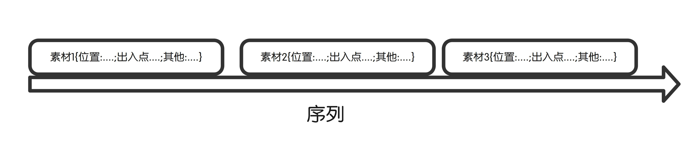

# 入门操作

## 概念-主体名词

所谓剪辑,就是将视频剪切再拼接在一起的一个过程,PR的主功能就是这个,另附加其他相关功能,如加字幕,音频处理,滤镜等.

- 剪辑相关:
    - 序列:媒体文件的排列方式
    - 源/素材:媒体也就是待剪辑的体
- 剪辑关系
    - 序列就是一个时间线表,规定了素材的排列组合以及图层关系等
    - 素材:即素材,视频原料
- 素材的脱机?
    - 序列只是素材的排列关系,并不包含素材,如果素材被移动,序列就不知道素材所在位置,所以素材就不能够被使用,序列相关内容就是空的

## 软件主体-四大区域

四大功能区域主要为:

- 剪辑相关
    - 时间轴区域
    - 节目区域
    
    > 节目面板主要用于预览序列,也可以说是预览整个工程
    >
    > 时间轴区域,就是编辑序列,对序列裁剪,加转场,等操作
    
- 素材处理区
    - 媒体素材箱区域
    - 源区域
    
    > 媒体素材箱,就是存放素材信息的面板,是一个存放整个工程的一个面板
    >
    > 源,素材的预览与编辑区域
    
    
    
    

